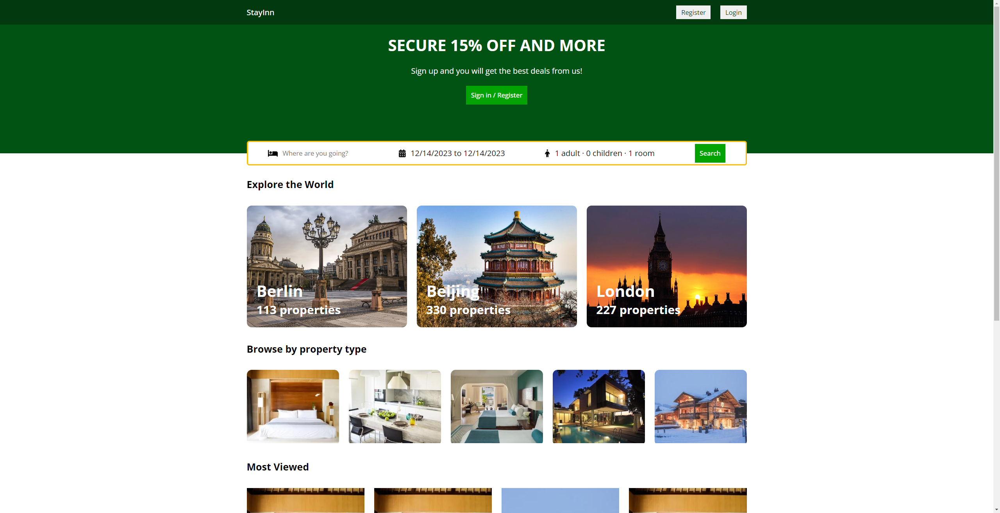
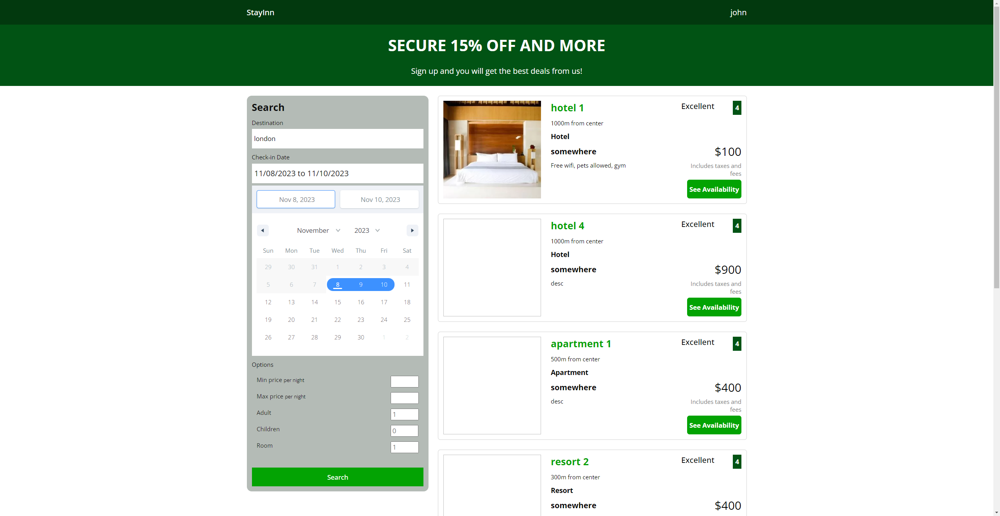
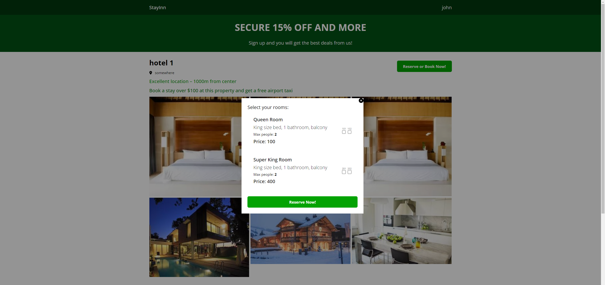

## StayInn-2.0 - Web Booking Application

### Project Objective
This is a full-stack web-based hotel booking platform designed to offer a seamless and interactive experience for users looking to book accommodations. Leveraging the power of AJAX for smooth, asynchronous web page updates, React for a responsive UI, and MongoDB for efficient data handling, we aim to deliver a hassle-free booking experience.

### Authors
* Congkai Sun
* Yue Huang

### Functionalities
* User Authentication: Secure user authentication system.Users can sign up, log in.
* Real-Time Search and reserve: Real-time search results and filtering options based on location, price, and max people. Users can reserve a hotel from the results.
* Detailed Hotel Information: Each listing will provide detailed information, including images, room availability.
* Admin Dashboard: For hotel owners and admins to manage user information and hotel information including CRUD.

### Updates
Here are updates to our full-stack web-based hotel booking platform, enhancing the user experience and overall functionality:

* User Authentication Update: We've integrated Passport for user authentication, streamlining the sign-in, sign-up, and logout processes for enhanced security and user convenience.

* Advanced Search Functionality: Users can now effortlessly search for rooms using a specific number of adults and kids, making it easier to find the perfect accommodation options.

* Improved Pagination Navigation: A new feature in the pagination section allows users to jump directly to a targeted page, significantly improving navigation efficiency.

* Keyboard Command Feature: To enhance user experience, we've implemented keyboard command functionality for easy navigation and interaction with the platform.

* Enhanced Sign-Up Visibility: The sign-up button has been redesigned for higher visibility, aiding new users in easily creating an account.

* Category Button Visual Update: We have enhanced the category button’s visual effects to clearly indicate page changes, ensuring a more intuitive user interface.

* Admin Page Layout Redesign: The admin page layout has been completely redesigned for improved usability and management efficiency.

* Overall Page Layout Redesign: We've revamped the page layout to ensure better alignment, consistency, and aesthetic appeal across the platform.

* Unified Typography: The platform now features unified typography to ensure clear contrast between different font styles, enhancing readability and visual harmony.

* Cohesive Color Palette: A comprehensive redesign introduces a cohesive color palette, elevating the website's visual appeal and user experience.

* Accessibility and Compliance: Our website is now fully accessible to screen readers and achieves a 100% Lighthouse score, ensuring comprehensive accessibility for all users.

### Instruction to build
* Download this project as zip file or clone to your own gits
```
cd client => yarn install or npm install => yarn start or npm start
cd api => yarn install or npm install => yarn start or npm start
```
* Place the .env file in the api folder

### Design Document
[Project 3 - StayInn-  Web Booking App.pdf](https://github.com/CERKO12/StayInn--Web-booking-application/files/13304354/Project.3.-.StayInn-.Web.Booking.App.pdf)

### Class Link
[CS5610-Web Development](https://johnguerra.co/classes/webDevelopment_fall_2023/)

### Demo Link
https://booking-frontend-inys.onrender.com/

### Screenshots
StayInn homepage



Login / Registration


Search lists


Reserve page

